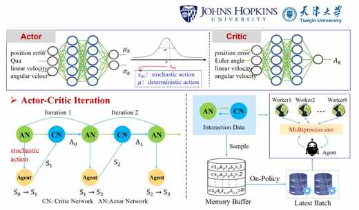
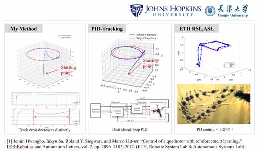

# The Control Strategy of QUAV Based on Deep Reinforcement Learning

Copyright 2026, Pengyu Chen, Johns Hopkins University. All Rights Reserved.

This project contains a MuJoCo quadrotor simulation, PID control utilities, and PPO reinforcement-learning code for training and evaluating a Crazyflie-style quadrotor policy.

<p align="center">
  
  
</p>

## Project Structure

- `crazyfile/`: MuJoCo XML model and mesh assets for the quadrotor.
- `envs/`: MuJoCo environment wrappers and the quadrotor task environment.
- `rl/`: PPO implementation, policies, distributions, storage, and wrappers.
- `robots/`: robot interface code that maps policy actions to motor commands.
- `run_experiment.py`: main training and evaluation entry point for the PPO workflow.
- `main3.py`: PID tracking demo in the MuJoCo viewer.
- `Q_ppo_train.py`: standalone PPO training script for `quadrotor_env.py`.
- `evaluate.py` and `evaluate2.py`: policy evaluation and trajectory plotting scripts.

## Setup

Create and activate a Conda environment, then install dependencies:

```powershell
conda create -n quadrotor-ppo python=3.12 -y
conda activate quadrotor-ppo
python -m pip install --upgrade pip
python -m pip install -r requirements.txt
```

MuJoCo uses OpenGL. On Windows, make sure your graphics drivers are installed and that Python can open a MuJoCo viewer window.

## Run The PID Demo

```powershell
python main3.py
```

This launches the MuJoCo viewer and runs the hand-written PID controller against the trajectory in `main3.py`.

## Train PPO

The main PPO workflow is:

```powershell
python run_experiment.py train --env h1 --logdir logs/experiment1 --mirror-coeff 0.5
```

Useful options:

- `--n-itr`: number of PPO iterations.
- `--num-procs`: number of Ray workers.
- `--mirror`: enable mirror symmetry loss.
- `--imitate path\to\actor.pt`: train with imitation from an existing actor.
- `--yaml envs\h1\configs\base.yaml`: use a specific environment config.

Training writes checkpoints and TensorBoard files under `logs/`. Those files are generated artifacts and are ignored by git.

## Evaluate A Policy

Evaluate a policy saved by `run_experiment.py`:

```powershell
python run_experiment.py eval --path logs/experiment1/actor.pt
```

Evaluate a standalone actor checkpoint with trajectory plots:

```powershell
python evaluate.py --model models/ppo_actor.pth
python evaluate2.py --model models/ppo_actor.pth
```

## Generated Files

The repository intentionally excludes generated outputs such as:

- `logs/`
- `plots/`
- `models/`
- `__pycache__/`
- `MUJOCO_LOG.TXT`
- `tracking_plot.png`

Regenerate them locally by running training, evaluation, or plotting scripts.

## License

All rights reserved. See [LICENSE](LICENSE) for details.
